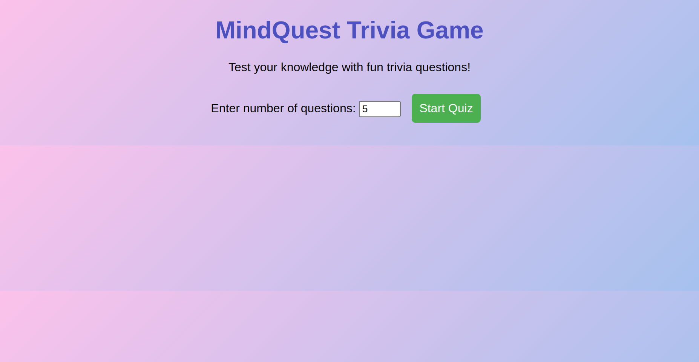
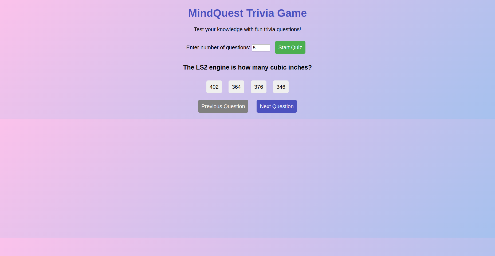
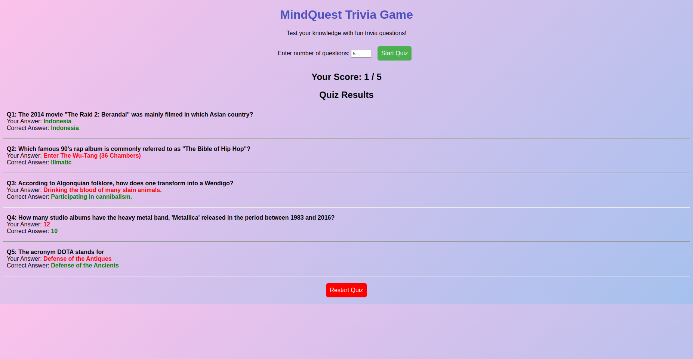

# MindQuest - Trivia Game

MindQuest is a fun and interactive trivia game that challenges your knowledge with multiple-choice questions from various categories. Built using **HTML, CSS, and JavaScript**, it fetches trivia questions dynamically from the Open Trivia Database (OpenTDB) API.

## Live Demo
[Click here to play MindQuest!](https://devbrianke.github.io/MindQuest/)

## Backend Repository  
- Backend Repository: [MindQuest Backend](https://github.com/DevBrianKE/trivia-backend)

## Features
- Fetches random multiple-choice trivia questions from OpenTDB.
- Allows users to select the number of questions (1-20).
- Interactive UI with selected answer highlighting.
- Next and Previous navigation between questions.
- Displays final results with correct and incorrect answers.
- Option to restart the quiz.

## Screenshots
### Home Screen


### Question Screen


### Results Screen


## Tech Stack
- **HTML5** - Structure and layout
- **CSS3** - Styling and animations
- **JavaScript (ES6+)** - Game logic and API integration
- **OpenTDB API** - Fetching trivia questions

## How to Play
1. Enter the number of questions (between 1 and 20).
2. Click the **Start Quiz** button.
3. Select an answer for each question.
4. Use the **Next** and **Previous** buttons to navigate.
5. View your results at the end and restart the quiz if desired.

## Installation & Setup
1. Clone the repository:
   ```sh
   git clone https://github.com/your-username/MindQuest.git
   ```
2. Navigate to the project folder:
   ```sh
   cd MindQuest
   ```
3. Open `index.html` in your browser or use Live Server for a better experience.

## Contributing
Contributions are welcome! If you’d like to improve the game, follow these steps:
1. Fork the repository.
2. Create a new branch: `git checkout -b feature-name`
3. Commit your changes: `git commit -m 'Added a new feature'`
4. Push to your fork: `git push origin feature-name`
5. Open a pull request.

## License
This project is licensed under the MIT License. See the [LICENSE](LICENSE) file for details.


